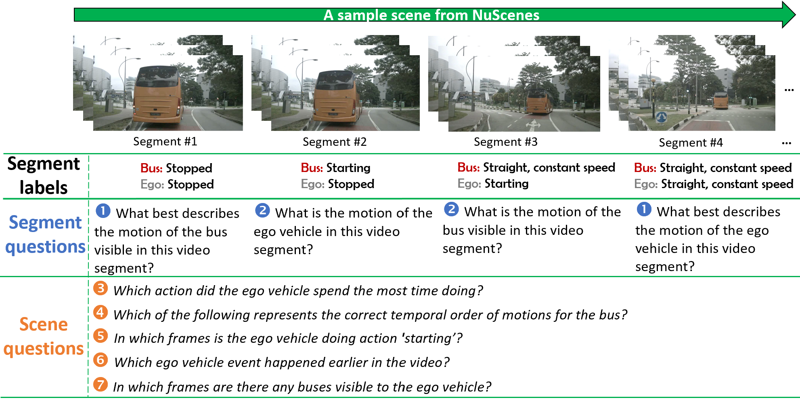
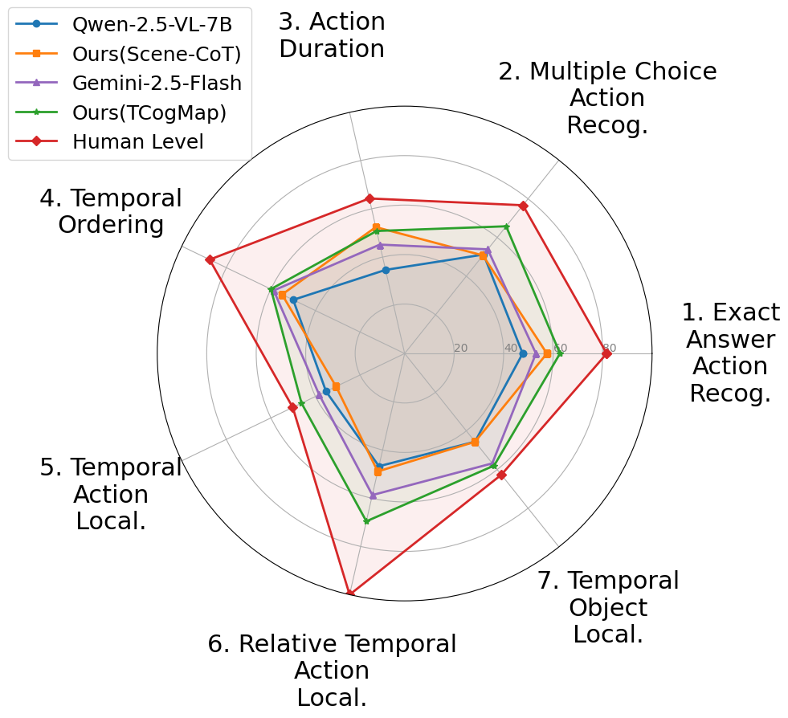

<div align="center">
  <h1>Official Code Release for "From Segments to Scenes: Temporal Understanding in Autonomous Driving via Vision-Language Models"</h1>
<a href="https://arxiv.org/abs/2512.05277" target="_blank">
    
</a>
<a href="https://huggingface.co/datasets/vbdai/TAD" target="_blank">
    
</a>
</div>

---
<p align="center">
  
  
</p>

# 📌 Key Highlights
- 🚗 Temporal Understanding in Autonomous Driving (**TAD**) benchmark: Consists of nearly 6,000 question–answer (QA) pairs, spanning 7 human‑designed tasks to evaluate VLMs’ ability to capture the dynamic relationships between actions in AD.  
- ⚡ **Scene-CoT** and **TCogMap:** Two novel, training-free solutions are proposed, one of which leverages Chain-of-Thought (CoT) and the other which incorporates an ego-centric temporal cognitive map. These approaches are shown to improve average accuracy on TAD by up to 17.72%
- 🚀 **Impact:** By introducing TAD, benchmarking multiple SoTA models, and proposing effective enhancements, this work will catalyze future research on temporal understanding in AD.


# TAD
The TAD benchmark is built on top of the NuScenes validation split, which contains 150 videos, each roughly 20 seconds in length, with accompanying sensor data and 3D bounding-box annotations. TAD focuses on the following fine-grained vehicle classes defined in NuScenes:  car, bus, bicycle, construction vehicle, motorcycle, trailer, and truck. The remaining object annotations were ignored for TAD.

## Set-Up
###	Conda Environment Setup

Create a conda env, then install the packages using the requirements.txt
```bash
$ conda create TAD_env python=3.10
$ conda activate TAD_env 
$ pip install -r ./requirements.txt
``` 
If your machine supports flash attention, installation of flash-attn==2.7.4.post1 is recommended for faster inference.

###	How to load the data
You can download the benchmakr using the following python code snippet. 
```bash
from datasets import load_dataset 

# --- Load a specific subset by name --- 
action_duration = load_dataset("vbdai/TAD", name="action_duration") 
exact_answer_action = load_dataset("vbdai/TAD", name="exact_answer_action") 
mc_action = load_dataset("vbdai/TAD", name="mc_action") 
relative_action_localize = load_dataset("vbdai/TAD", name="relative_action_localize") 
temp_action_localize = load_dataset("vbdai/TAD", name="temp_action_localize") 
temp_object_localize = load_dataset("vbdai/TAD", name="temp_object_localize") 
temp_ordering = load_dataset("vbdai/TAD", name="temp_ordering") 
keysegments = load_dataset("vbdai/TAD", name="keysegments") 
raw_labels = load_dataset("vbdai/TAD", name="raw_labels") 
print("\nSuccessfully loaded TAD benchmark from HF Hub")
```
Then insert the path of the .cache folder including the benchmark splits (e.g. C:\user\.cache\huggingface\datasets\vbdai___tad\) into $BENCHMARK_PATH in the shell files discussed in the following sections (Shell Scripts).

## Baseline and Proposed Solutions
The proposed solutions, Scene-CoT and TCogMap, are training-free and can be applied on top of any VLM to provide improved temporal understanding.  These approaches are shown to improve average accuracy on TAD by up to 17.72%

### Source Code
Code is provided for the baseline as well as our implementations of both **Scene-CoT** and **TCogMap**. There are two distinctly different types of tasks in TAD: segment-level and scene-level. Segment level tasks use a short, pre-cropped section of a larger video and pose action recognition-style questions; whereas, scene-level questions consider the entire video and ask questions that require a complete understanding of the actions that span the full extent of the video. 

To accommodate these two question types, a total of six <em>.py</em> files are provided. Each approach (baseline, **Scene-CoT**, and **TCogMap**) has two files one for segment questions types and one for scene questions. Specifically, the following Python files have the following names: <ul>
<li><em>X_segments.py</em></li>
<li><em>X_scenes.py</em></li>
</ul>
where <em>X</em> is one of {baseline, scene_cot, tcogmap}.

### Inference Engines
LMDeploy is used as the inference engine for the VLMs in our various implementations, due to its faster inference time (higher throughput), amongst other benefits. For the proposed Scene-CoT, an LLM is used during question-answering, and Hugging Face TGI is used, for simplicity.

### Shell Scripts
For convenience, shell scripts are provided that run either the baseline, **Scene-CoT**, or **TCogMap** for all question types and subsequently performs the official evaluation by comparing the model answers to the ground truth. The shell scripts can be run as follows:

<pre>
# runs a baseline VLM on TAD and performs evaluation. You need to set the path in the shell script prior to running them. 
bash baseline.sh     

# runs Scene-CoT with a specified VLM on TAD and performs evaluation
bash scene_cot.sh           

# runs TCogMap with a specified VLM on TAD and performs evaluation
bash tcogmap.sh		
</pre>

### Evaluation
Evaluation code is included in the file <em>evaluation.py</em>. In the above shell scripts, the evaluation code is automatically launched following the completion of the method (baseline, **Scene-CoT**, or **TCogMap**). The Python evaluation code can alternatively be run independently, and only requires the path containing the model’s answers as the input argument.  Assuming a model’s answers are in the directory, <em>/path/to/your/answers/</em>, the evaluation code can be run using:
<pre>
python evaluation.py –preds_dir <em>/path/to/your/answers/</em>
</pre>
As shown in the paper itself, it is also possible to run the evaluation on different question subsets, based on whether the questions are concerning the ego vehicle or other vehicles in the scene. This option can be triggered using the input argument <em>--eval_mode</em>. To run the evaluation only on question related to the ego vehicle, <em>--eval_mode</em> is set to <em>ego</em>, i.e.,:
<pre>
python evaluation.py –preds_dir “/path/to/your/answers/” –eval_mode “ego”
</pre>
Conversely, to only evaluate questions related to non-ego objects, the following command is used:
	python evaluation.py –preds_dir “/path/to/your/answers/” –eval_mode “non-ego”
By default, this “—eval_mode” is set to “all”, meaning that all questions are evaluated.


## Segment details in TAD 
### keysegment split
The "keysegment'' split in the released dataset defines the temporal segmentation logic for the benchmark. It is used to map specific video segments to their corresponding temporal windows (sequences of frames) required for segment-level reasoning tasks.

Each record represents a single scene, identified by a `scene_token`, and contains mappings that define how the video is sliced into overlapping segments. These segments are anchored by a "middle" or "key" frame and include the surrounding context frames. These frames are loaded during inference using the nuscenes-devkit.

#### Key Fields
To ensure compatibility with Hugging Face features, the raw dictionary mappings have been transformed into structured lists:

*   **`keyframes_token_formatted`**:
    *   Used to retrieve segment context via **frame tokens**.
    *   Structure: A list of dictionaries, where `segment_key` is the token of the anchor (middle) frame, and `frames` is a list of all frame tokens included in that segment.
    
*   **`keyframes_index_formatted`**:
    *   Used to retrieve segment context via **frame indices** (0-indexed relative to the scene).
    *   Structure: A list of dictionaries, where `segment_index_key` is the index of the anchor (middle) frame, and `indices` is a list of integers representing the temporal window of that segment.

#### Usage
When evaluating segment-level questions in the benchmark, use these mappings to identify which subset of frames (context) needs to be loaded for a specific segment identifier. Please have a look at the <em>X_segments.py</em> files to find examples for  loading the segments. 


### Localization evaluation 

For the **Temporal Object Localization** and **Temporal Action Localization** tasks, the prompts explicitly ask the model to list specific frame numbers; however, the ground truth annotations are defined at the segment level (represented by the keysegment indices). To accommodate this, we employ a mapping strategy (implemented via `parse_and_map_keysegments`) during evaluation. This process parses the model's predicted frame indices and maps them to the corresponding keysegments by identifying which segment windows contain the predicted frames. Finally, the accuracy is then determined by calculating the **mean Intersection over Union (mIoU)** between the set of mapped predicted segments and the ground truth segment list.

## Citation 
If this code is useful, please cite it in your documents.
```
@misc{tad_bench,
      title={From Segments to Scenes: Temporal Understanding in Autonomous Driving via Vision-Language Models}, 
      author={Kevin Cannons, Saeed Ranjbar Alvar, Mohammad Asiful Hossain,Ahmad Rezaei, Mohsen Gholami, Alireza Heidarikhazaei, Zhou Weimin, Yong Zhang,Mohammad Akbari},
      year={2025},
      eprint={2512.05277},
      archivePrefix={arXiv},
      primaryClass={CV},
      url={https://arxiv.org/abs/2512.05277}, 
}
```

## References
The benchmark is created based on NuScenes dataset. The tools in [nuscenes-devkit](https://github.com/nutonomy/nuscenes-devkit) are used for loading and analyzing NuScenes dataset.We thank the contributors for their great work!


## License

Shield: [![CC BY-NC-SA 4.0][cc-by-nc-sa-shield]][cc-by-nc-sa]

This work is licensed under a
[Creative Commons Attribution-NonCommercial-ShareAlike 4.0 International License][cc-by-nc-sa].

[![CC BY-NC-SA 4.0][cc-by-nc-sa-image]][cc-by-nc-sa]

[cc-by-nc-sa]: https://creativecommons.org/licenses/by-nc-sa/4.0/
[cc-by-nc-sa-image]: https://licensebuttons.net/l/by-nc-sa/4.0/88x31.png
[cc-by-nc-sa-shield]: https://img.shields.io/badge/License-CC%20BY--NC--SA%204.0-lightgrey.svg


